# Space Rift Intersecting Circle Puzzles

I made $\sqrt{z^2-1}$ into a twisty puzzle!! 

[Play](https://worldmaker18349276.github.io/twisty-space-rift/)

## Puzzle lists

- [Dipole(2) H](https://worldmaker18349276.github.io/twisty-space-rift/#D2H)

    texture and space: $\sqrt{z+1} \sqrt{z-1}$

    A puzzle with a horizonal space rift that glues two sheets together.  You should rotate 720 degree to make a turn.

- [Dipole(3) H](https://worldmaker18349276.github.io/twisty-space-rift/#D3H)

    texture and space: $(z+1)^{1/3} (z-1)^{2/3}$

    Just like Dipole(2) H, but the space rift glues three sheets together.  You should rotate 1080 degree to make a turn.

- [Dipole(2) V](https://worldmaker18349276.github.io/twisty-space-rift/#D2V)

    texture and space: $\sqrt{z+i} \sqrt{z-i}$

    Just like Dipole(2) V but the space rift is vertical.  The endpoints of the space rift are moveable.  By moving two endpoints to the same side, circles on the different layers can be rotated indivisually; this is similar to [Pluton's Enigma](https://www.youtube.com/watch?v=7W8I0CQcCzs).

- [Dipole(3) V](https://worldmaker18349276.github.io/twisty-space-rift/#D3V)

    texture and space: $(z+i)^{1/3} (z-i)^{2/3}$

    Just like Dipole(2) V but with three sheets.

- [Quadrapole(3)](https://worldmaker18349276.github.io/twisty-space-rift/#Q3)

    texture and space: $(z+1)^{1/3} (z-1)^{2/3} (z+i)^{1/3} (z-i)^{2/3}$

    It is just a combination of Dipole(3) H and Dipole(3) V.  It shows how two branch cuts works, but have no interesting property since they commute each other.

- [Dipole(2)^2](https://worldmaker18349276.github.io/twisty-space-rift/#DD)

    texture and space: consists of

    - $(z+1)^{1/2} (z-1)^{1/2} (z-i)^{1/2} (z+i)^{1/2}$
    - $- (z+1)^{1/2} (z-1)^{1/2} |z + i \, \mathrm{sign}(\Im[z])|$
    - $|z + \mathrm{sign}(\Re[z])| (z-i)^{1/2} (z-i)^{1/2} z/|z|$

    It is similar to Quadrapole(3), but two branch cuts don't commute, which makes them interlock each others, but not fun to play as a result.  These two rifts glue different pairs of sheets, so one can observe that branch points will be submerged in another rift.

## How Does It Work

### Branch Cuts

`sqrt(z²-1)` cannot be fully drawn on a paper, since there are two solutions for square root.  If you make a plot, you will see a discontinuous line:

.png)

How could a simple analytic function produce discontinuous results? This is the avidence that not all are plotted.

The square root `c = sqrt(z)` is defined as the solution to the equation `c² = z`, which has two solutions, but we usually only take one.  For example, we say `sqrt(4)` is `2`, but actually it also can be `-2`.  For a positive input, we always choose the positive solution.  This choice is not bad, since it is continuous: when the input changes, the output changes smoothly. But if we consider complex numbers, things get complicated.  Since complex numbers have one more degree of freedom, the value can vary in two directions.  When the input `z` move around the origin, that is, varying `t` in `z = e^(it)`, the value of output can be `sqrt(z) = e^(it/2)`, so that the function is continuous.  However, if it make a turn around the origin, the output will have a difference on the sign: `sqrt(e^(2πi)) = e^(πi) = -1`.

The plot drawn above only uses one of the solutions of the square root, there is another hidden plot drawn on the sheet under it.  The discontinuous line in the plot, called the **branch cut**, is just like a space rift of this 2D space, which is the gate to the hidden sheet.  If there is a creature live in in this space, it will see through this gate and not notice the branch cut.  The branch cut is artificial due to the choice of solution, which can be changed if we make a different choice.  We plot it like this because we don't have proper paper that fit this space.  However, the 2D creature will notice that the left and right views are different when look around the point `1+0i`, called **branch point**.  It is like the game "Antichamber", the view will be different when look through different windows.  The actual space looks like:

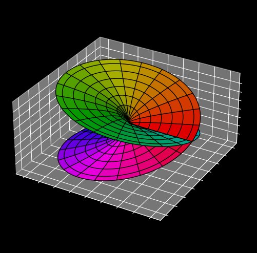

It's like two pieces of paper stuck together along the cut but crossing each other, and such type of space is called a **Riemann surface**.  The 2D plot of `sqrt(z)` can be seen as a top view of it, so a branch cut is just the visual effect of intersection line between the two surfaces.  By adjusting z value of this surface, the branch cut will move.  However, the branch point, which is at the center of this surface, will not change.  Notice that a true Riemann surface lies on 4D space, where they do not intersect each other.

I made a twisty puzzle out of `sqrt(z²-1)`, called [Dipole(2) H](https://worldmaker18349276.github.io/twisty-space-rift/#D2H).  It is just like an intersecting circle puzzle but on the Riemann surface of the function.  Unlike usual puzzles, one should rotate 720 degree to make a turn, since pieces will move to another layer while rotating.  You can draw on the puzzle [Dipole(2) H](https://worldmaker18349276.github.io/twisty-space-rift/#D2H) and twist it, you will see your painting submerged in the rift.  The abstract model of this puzzle is just like usual one, but it is not easy to draw on the 2D space, since one should decide which part should be drawn based on the branch cut.  I allowed the branch cut to move freely to emphasize that it is irrelevant to this puzzle.

### Branch Points

The puzzle [Dipole(2) H](https://worldmaker18349276.github.io/twisty-space-rift/#D2H) is made out of `sqrt(z+1) sqrt(z-1)`, which is a two-valued function, that means one should rotate the rift (the branch cut) two turns to return to the same view.  Another simular puzzle [Dipole(3) H](https://worldmaker18349276.github.io/twisty-space-rift/#D3H) is made out of `(z+1)^(1/3) (z-1)^(2/3)`, which is a three-valued function, that means one should rotate the rift three turns to return to the same view.

In the puzzle [Dipole(2) H](https://worldmaker18349276.github.io/twisty-space-rift/#D2H) and [Dipole(3) H](https://worldmaker18349276.github.io/twisty-space-rift/#D3H), the pieces are on the Riemann surface but not on a normal 2D Euclidean space, and the branch cut is just an artificial boundary, just like we cannot draw a global map on a paper without introducing artificial boundary.  Unlike branch cuts, branch points are not artificial but intrinsic structures of the space.  That is why we place them at the twist centers of puzzles such that they can be rotated, because branch points cannot be moved, right?  Actually they can be moved freely, and I made puzzles [Dipole(2) V](https://worldmaker18349276.github.io/twisty-space-rift/#D2V) and [Dipole(3) V](https://worldmaker18349276.github.io/twisty-space-rift/#D3V) as a proof, they are made out of `sqrt(z+i) sqrt(z-i)` and `(z+i)^(1/3) (z-i)^(2/3)`.

When a piece moves, the internal branch point must move together, that means the structure of the space changes for this piece, otherwise it will be teared apart by the space.  Even the structure of the space is twisted, the topological structure of the space doesn't change.  There is another way to think of it: pieces of the puzzle are not on the space, but are the space itself.  A twist of the puzzle is to cut the space along a circle and slide the space along it.  The mechanism of the program is more like this point of view.

In the puzzle [Dipole(2) V](https://worldmaker18349276.github.io/twisty-space-rift/#D2V), since the branch points can be moved now, one can move two branch points to the same side, and the other side will become normal circle: one can make a turn by rotating just 360 degree, and the circles on different layers can be rotated independently now.

### Multiple Branch Cuts

What happen for the puzzle with two branch cuts (four branch points)?  There are several issues that need clarification.

By multiplying the functions of Dipole(3) H and Dipole(3) V, we made puzzle [Quadrapole(3)](https://worldmaker18349276.github.io/twisty-space-rift/#Q3).  To connect multiple branch points by branch cuts, one should follow the rule: the branch point of the form `(z+a)^n` should be connected to the branch point of the form `(z+a)^(0-n)` or `(z+a)^(1-n)`, etc.  For this puzzle there are two ways to connect branch points.  Moreover, one branch point can have multiple branch cuts on it: `(z+a)^(2/3)` can be decomposed to `(z+a)^(1/3) (z+a)^(1/3)`, and each term has its own branch cut.  In fact, any point on the branch cut can be treated as a term `(z+a)^(-1/3) (z+a)^(1/3)`, so that there are two branch cuts on it.  To simplify, we only connect one branch cut for each branch point, and the configuration cannot be changed, that is, branch cuts of Quadrapole(3) are just like Dipole(3) H and Dipole(3) V.

In the program, we need to track the relative position between rift and pieces of puzzle, so that when a rift sweep past a piece, it should be submerge into another layer.  But this is not easy due to numerical error, so we only determine the layer of the pieces near the branch points, and use them to determine the layers of all other pieces by adjacencies.  The way to determine the layer near the branch points is stable, since we directly track the angle of the branch cut on the branch point.
But now we have multiple branch cuts, and when two branch cuts enclose a region, we cannot determine its layer.  We need to determine layers across branch cuts.  For example, the piece on the layer `n` of the puzzle [Dipole(3) H](https://worldmaker18349276.github.io/twisty-space-rift/#D3H) pass through the branch cut from below will goto layer `(n+1)%3`.  More interestingly, when a branch point pass through the branch cut from below, the property of branch point also changes, so that the way we determine the layer near the branch point is consistent with the above effect.

However, above discussion only works on this puzzle, which only use the same type of branch points and branch cuts.  For different types of branch cuts, when a branch cut passing through another branch cut, the way how a piece submerged through it should also change.  When the roles are reversed, the result may become different, that means the configuration of branch cuts is not just a bunch of 2D lines.  To explain how this works, a more basic question need to be clarified: how a branch cut moves?

### Movement Of Branch Cuts

An analytic formula, say `(z+1)^(1/3) (z-1)^(2/3)`, has multiple solutions almost everywhere, in this example it has three solutions for every input `z` except for `z = 1` and `z = -1` (**branch points**).  Assume we find a way to sort those solutions for each input `z`, and by drawing $n$-th solution as $n$-layer of plot, they looks almost continuous.  The discontinuous parts form curves connecting two branch points, called a **branch cut**.  In this multi-layer plot, $n$-th solution at point `z` is very close to the $n$-th solution at adjacent point `z + dz`, but this doesn't hold for those branch cuts.  For this law to hold, a permutation should be further applied when crossing branch cuts.  For above example, if it crosses the branch cut from below, the $n$-th solution at point `z` is very close to the $\sigma(n)$-th solution at adjacent point `z + dz`, where the permutation is denoted as $\sigma = (0\,1\,2)$ in the cycle notation:

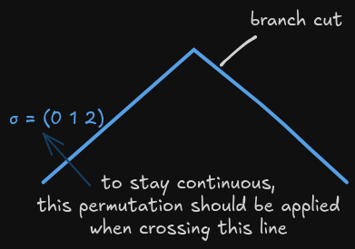

"Move a branch cut" means reorder the solutions around the branch cut, which will make the boundary of reorder region a new branch cut, and they will be merged by cancelling out common part:

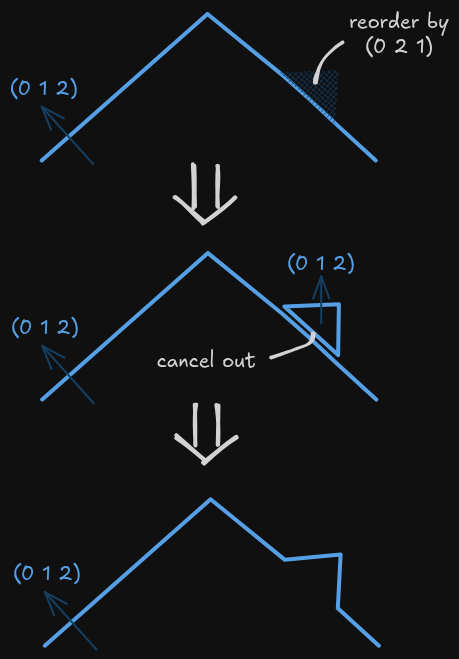

Branch cuts can be moved through this process, but branch points (the endpoints of branch cuts) cannot, that shows branch points are internal structure.
With this model, we can track the permutation it accumulated of a point moving through this space, so that it remains continuous throughout time.  If the point eventually returns to the starting point, the accumulated permutation is only related to branch points enclosed by the path, and this property has nothing to do with how we order the solutions.  Using this property, we can determine which point is branch point: consider a point moves along an arbitrary small circle, if the accumulated permutation is not an identity, the center point is a branch point, otherwise the center point is not a branch point.

### Crossing Over Branch Cuts

Ok, now we know how branch cuts actually move, then we want to follow the same way to study what happen if branch cuts cross each other.  When branch cuts don't intersect each others, we can recognize them by connectivity, but if they intersect, we need a new method to identify branch cuts.  An obvious alternative way is to use permutations to identify them, but this is illegal.  As a counter-example, two branch cuts with permutations $(0\,1\,2)$ and $(0\,1)$ cannot cross each other, otherwise their intersection point will violate the law:

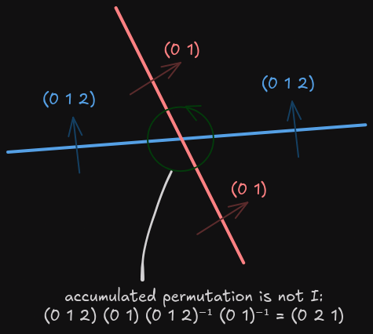

Only the branch cuts whose permutations commute can do that.  This suggests that when two branch cuts cross, their permutations must change in some way.  In fact, there is no identity for branch cuts, and they can be any two-dimensional shape, not just simple curves.  But for simplicity of the game (and for reducing implementation complexity), we need to artificially restrict branch cuts as simple curves, and find a way to identify them when they cross each other.

To formulate crossing rules for branch cuts, the **principle of locality** must be considered: local changes should not change other distant parts.  For example, when a branch cut moves, only the view of the region sweeped by this branch cut should changes.  With this principle, we can figure out how two branch cuts cross by examining some situations.  There are two types of crossing events: branch cut crosses over branch cut, and branch cut crosses over branch point:

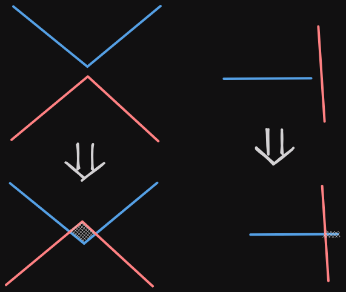

For the first type of crossing event, it produces an isolated region where we don't know what the order of solutions should be, which is useless for determining crossing rules.  For the second type of crossing event, only the permutation of the sweeped part of the branch cut will change.  Since the accumulated permutation around the intersection point must be an identity, it can be derived easily:

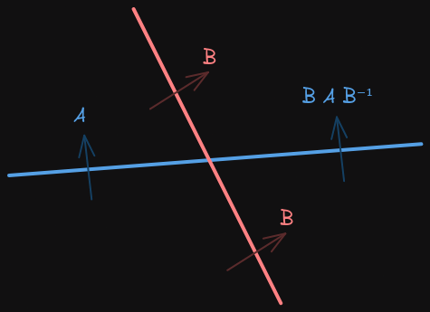

On the crossing point, we say the red branch cut **crosses over** the blue branch cut, and the blue branch cut **crosses under** the red branch cut.  Given a crossing point between two branch cuts, there are two possible crossing relation which can be recognized via this relation of permutations.  But for two branch cuts whose permutations commute, these two possible relations are all valid.  We don't allow three branch cuts to intersect at one point, which rarely happens and would make things too complicated.
It is necessary to prove that crossing points can also be moved:

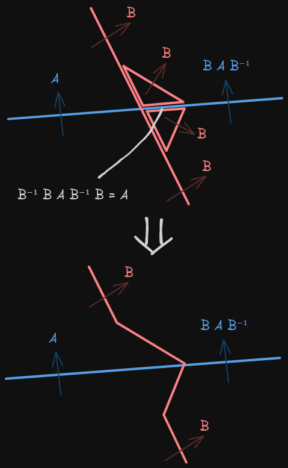

We use the word **"cross over"** and **"cross under"** to describe two types of crossing relations, because they are knots in the mathematical sense.  For example, if two branch cuts tangled together, they cannot be untied easily just like a knot:

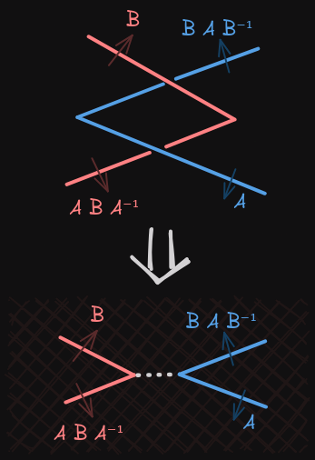

More strictly, one can prove that three Reidemeister moves are valid for branch cuts:

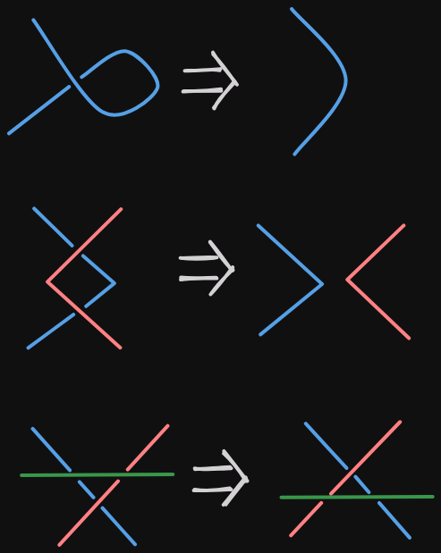

Unlike normal knot theory, branch cuts have endpoints, so there is an additional move:

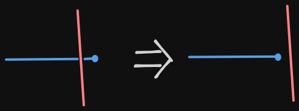

Where the blue dot represents an endpoint of the branch cut.  If the red wire is under the blue wire, this move cannot be applied, just like the blue dot pins the blue wire on the table, so the red wire cannot be pulled out.
If two segments of branch cuts commute, the cross between them can be treated as crossing under or over, and this type of crossing also follows similar rules.

### Knot of Branch Cuts

We constructed a knot model for branch cuts, they can cross each others just like real strings.  Previously we say that branch cuts are not real but just an illusion of intersection line of embedded Riemann surface, but now they act like a real strings, that is because we restrict shapes of branch cuts.  Still, there are many possibilities with this model.  Now let's see how far they can go.

We construct a puzzle with two uncommuted branch cuts called [Dipole(2)^2](https://worldmaker18349276.github.io/twisty-space-rift/#DD).  Since the horizonal branch cut is locked by the vertical branch cut, one cannot twist this puzzle without untangling it.  However, even if we restrict the shape of a rift to be two straight lines, the crossing rules are still too complicated for implementation (the current implementation is already too unstable), so we further disallow tangled rifts, that is, a rift should be always under or over another rift in all intersections.
If we allow tangled rifts, in theory one can make a state like:

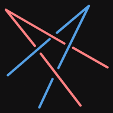

If we further allow any curve shapes of rift, there are more possibilities to tie branch cuts into a mess.  Moreover, in this setting there are multiple ways to connect two branch points by a branch cut -- one can make a knot on a branch cut:

This knot cannot be untied into a straight string.  One can even make a knot with a loop string:

This doesn't involve any branch point, but is not a trivial branch cut as it cannot be untied.
Not any knot are valid in this model, for example:

This configuration is only possible when the permutations of these two branch cuts commute each other, and in this case it can be untied.

These examples show that the knot model of branch cuts may be a wrong direction, it violates our original intention: branch cuts should not be a part of game, but now we are plagued with untangling them.

### Conclusion

This work makes twisty puzzles on the space which is uniform almost everywhere, and its finite exception points make puzzles interesting.  Here we only focus on the ramified 2D Euclidean space, which is not limited to the Riemann surface of an analytic function, they can also be any possible ramified space.  Those puzzles are built upon the simplest intersecting circle puzzle, which only shows a few possibilities for this model; it can be more freedom and chaos.  I believe this is enough to expand our imagination of twisty puzzles and the spaces we inhabit.

One can also build ramified spaces on a sphere, and in fact all star polyhedra can be thought of as this type of space.  Ramified Euclidean spaces can be thought of a specific way to glue multiple Euclidean spaces, and there are other ways to do that.  For example, one can glue two distant rifts together to form a portal.  Moreover, they can be glued with the same or opposite chirality, or even with different scale or any invertible transformation.

Generalize this concept to 3D space, branch points becomes 1D branch ring (or more complex shapes), and branch cuts become 2D surfaces.  Because now the boundary of branch cuts is connected, they seem cannot be freely moved like our model.  In 3D space, portal-like gluing are also valid, see [portal in 3D space](https://www.youtube.com/watch?v=o19xXsouJAc) and [polycut](https://kenbrakke.com/polycut/polycut.htm).
